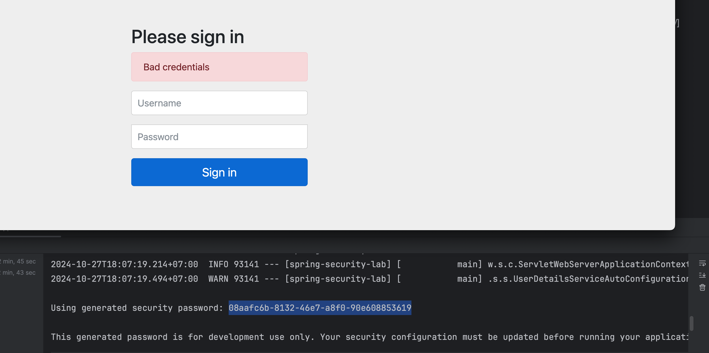
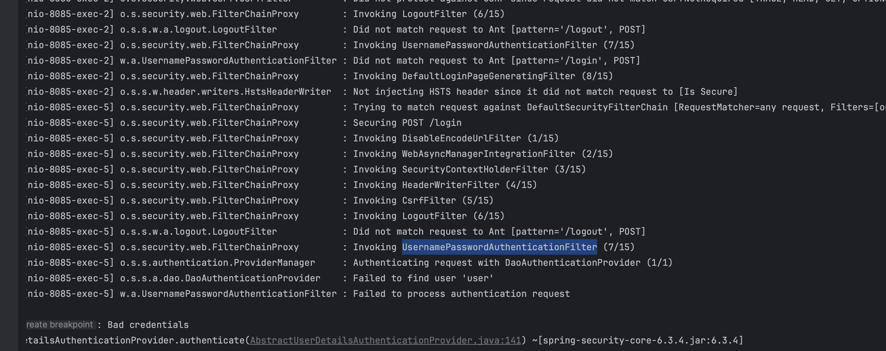

# Lab1 Spring security with user password
Initialize project จะเจอหน้า login สำหรับทุก endpoint เลย


- ตอน run จะมี log default password และตัว default user คือ user
- ถ้า login ถูกจะปล่อยให้เข้าไปแล้วเจอ whitelabel
- ถ้า login ผิดจะขึ้น Bad credentials

เริ่มต้นด้วยการ ลองเปลี่ยน password เข้าไปใน in memory database
```java
@EnableWebSecurity
@Configuration
public class SecurityConfig {
    @Bean
    InMemoryUserDetailsManager inMemoryUserDetailsManager() {
        String customPassword = "{noop}halow";
        return new InMemoryUserDetailsManager(
                User.withUsername("user")
                        .password(customPassword)
                        .roles("user")
                        .build()
        );
    }
}

```
- จำเป็นต้องใส่ {noop} ไว้หน้า password ด้วยเพราะว่าใช้ password ตรง ๆ ไม่ได้ encrypt

ลองเพิ่ม user เข้าไปอีกสัก 10 คนนึง ด้วยการปรับ code เพื่อสร้าง collection
```java
@EnableWebSecurity
@Configuration
public class SecurityConfig {
    @Bean
    InMemoryUserDetailsManager inMemoryUserDetailsManager() {
        String customPassword = "{noop}halow";
        List<UserDetails> users = new ArrayList<>();
        for (int i = 0; i < 10; i++) {
            users.add(User.withUsername("user" + i)
                    .password(customPassword + i)
                    .roles("user")
                    .build());
        }

        return new InMemoryUserDetailsManager(users);
    }
}
```

ลองเปิด log trace เพื่อดูว่าจริง ๆ แล้วโดย default มันวิ่งไปที่ filter หรือ provider ตัวไหนบ้าง
```shell
logging.level.org.springframework.security=TRACE
```

- default filter: UsernamePasswordAuthenticationFilter
- default provider: DaoAuthenticationProvider
- - พอเป็น Dao มันก็จะวิ่งไปหา class UserDetailService โดยจาก code 
ด้านบนได้มีการ inject bean inMemoryUserDetailManager เพื่อแอบใส่ user 
เข้าไปใน inMemory แล้วก็จะเอา user ที่เข้ามาใน request มาเทียบกับของที่อยู่ใน inMemory เอง


# Lab2 custom filter
อยากลองใช้ filter chain มาเพื่อดัก request ก่อนที่จะวิ่งไปหา AuthenticationProvider
