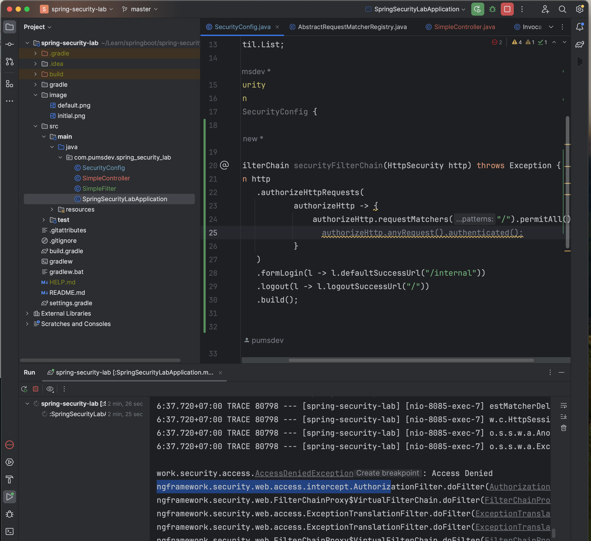

# Lab1 Spring security with user password
Initialize project จะเจอหน้า login สำหรับทุก endpoint เลย


- ตอน run จะมี log default password และตัว default user คือ user
- ถ้า login ถูกจะปล่อยให้เข้าไปแล้วเจอ whitelabel
- ถ้า login ผิดจะขึ้น Bad credentials

เริ่มต้นด้วยการ ลองเปลี่ยน password เข้าไปใน in memory database
```java
@EnableWebSecurity
@Configuration
public class SecurityConfig {
    @Bean
    InMemoryUserDetailsManager inMemoryUserDetailsManager() {
        String customPassword = "{noop}halow";
        return new InMemoryUserDetailsManager(
                User.withUsername("user")
                        .password(customPassword)
                        .roles("user")
                        .build()
        );
    }
}

```
- จำเป็นต้องใส่ {noop} ไว้หน้า password ด้วยเพราะว่าใช้ password ตรง ๆ ไม่ได้ encrypt

ลองเพิ่ม user เข้าไปอีกสัก 10 คนนึง ด้วยการปรับ code เพื่อสร้าง collection
```java
@EnableWebSecurity
@Configuration
public class SecurityConfig {
    @Bean
    InMemoryUserDetailsManager inMemoryUserDetailsManager() {
        String customPassword = "{noop}halow";
        List<UserDetails> users = new ArrayList<>();
        for (int i = 0; i < 10; i++) {
            users.add(User.withUsername("user" + i)
                    .password(customPassword + i)
                    .roles("user")
                    .build());
        }

        return new InMemoryUserDetailsManager(users);
    }
}
```

ลองเปิด log trace เพื่อดูว่าจริง ๆ แล้วโดย default มันวิ่งไปที่ filter หรือ provider ตัวไหนบ้าง
```shell
logging.level.org.springframework.security=TRACE
```

- default filter: UsernamePasswordAuthenticationFilter
- default provider: DaoAuthenticationProvider
- - พอเป็น Dao มันก็จะวิ่งไปหา class UserDetailService โดยจาก code 
ด้านบนได้มีการ inject bean inMemoryUserDetailManager เพื่อแอบใส่ user 
เข้าไปใน inMemory แล้วก็จะเอา user ที่เข้ามาใน request มาเทียบกับของที่อยู่ใน inMemory เอง


# Lab2 custom filter
อยากลองใช้ filter chain มาเพื่อดัก request ก่อนที่จะวิ่งไปหา AuthenticationProvider

ก่อนจะเริ่มทำเรื่อง filter จะต้องทำเรื่อง SecurityConfig ก่อน ต้องมีการ Overide ค่า SecurityFilterChain
ก่อน เพื่อให้สามารถ register ตัว filter ของเราเข้าไปได้

โดยจะเริ่มจาก basic ให้มี form login เหมือนเดิม
```java
//...
public class SecurityConfig {
    //...
    @Bean
    SecurityFilterChain securityFilterChain(HttpSecurity http) throws Exception {
        return http
                .authorizeHttpRequests(
                        authorizeHttp -> {
                            authorizeHttp.requestMatchers("/").permitAll();
                            // authorizeHttp.anyRequest().authenticated();
                        }
                )
                .formLogin(l -> l.defaultSuccessUrl("/internal"))
                .logout(l -> l.logoutSuccessUrl("/"))
                .build();
    }
    //...
}
```
- จาก code ด้านบนจะมีการ hide anyRequest().authenticated(); ไว้อยู่เพื่อดู behavior
ว่าถ้าเราไม่เปิดจะเป็นยังไง

ผลลัพธ์ที่ได้คือ

- ก็คือ โดน denied หมดเลย

แต่ถ้าเรา uncomment anyRequest().authenticated() ออกก็คือถ้า login ผ่านก็จะสามารถเข้าใช้งานได้
```java
//...
public class SecurityConfig {
    //...
    @Bean
    SecurityFilterChain securityFilterChain(HttpSecurity http) throws Exception {
        return http
                .authorizeHttpRequests(
                        authorizeHttp -> {
                            authorizeHttp.requestMatchers("/").permitAll();
                            authorizeHttp.anyRequest().authenticated();
                        }
                )
                .formLogin(l -> l.defaultSuccessUrl("/internal"))
                .logout(l -> l.logoutSuccessUrl("/"))
                .build();
    }
    //...
}
```
เพื่อทดสอบการ login ให้เพิ่ม SimpleController สักตัวนึงให้สอดคล้องกับ config ด้านบน
```java

@RestController
public class SimpleController {
    private static final Logger logger = LoggerFactory.getLogger(SimpleController.class);
    @GetMapping("/")
    public String publicPage() {
        logger.debug("On public page");
        logger.debug("getPrincipal {}", SecurityContextHolder.getContext().getAuthentication().getPrincipal());
        return "Public";
    }

    @GetMapping("/internal")
    public String internal(Authentication authentication) {
        logger.debug("Object after login");
        logger.debug("getPrincipal {}", SecurityContextHolder.getContext().getAuthentication().getPrincipal());
        logger.debug("getName {}", authentication.getName());
        return "Hallow internal";
    }
}
```
- การทดสอบเบื้องต้น เข้า localhost:8085/internal จะติดต้อง login
- หลังจาก login เสร็จจะเจอหน้าแสดง text "Hallow internal"
- ถ้าอยู่ที่ path / ไม่จำเป็นต้อง login แต่จะต้องเห็น text "Public"

ลองสร้าง SimpleFilter และ register เข้าไป

```java
public class SimpleFilter extends OncePerRequestFilter {
    private static final Logger logger = LoggerFactory.getLogger(SimpleFilter.class);
    @Override
    protected void doFilterInternal(HttpServletRequest request,
                                    HttpServletResponse response,
                                    FilterChain filterChain)
            throws ServletException, IOException {

        logger.debug("hola SimpleFilter");

        filterChain.doFilter(request, response);
    }
}
```
- การทำงานของ Filter คือจำเป็นต้องส่งต่อ filterChain ไปด้วย และของที่อยู่บนคำสั่ง filterChain.doFilter() จะหมายถึง
ขา request ส่วน หลัง doFilter จะเป็นขา response


```java
//...
public class SecurityConfig {
    //...
    @Bean
    SecurityFilterChain securityFilterChain(HttpSecurity http) throws Exception {
        return http
                .authorizeHttpRequests(
                        authorizeHttp -> {
                            authorizeHttp.requestMatchers("/").permitAll();
                            authorizeHttp.anyRequest().authenticated();
                        }
                )
                .formLogin(l -> l.defaultSuccessUrl("/internal"))
                .logout(l -> l.logoutSuccessUrl("/"))
                .addFilterBefore(new SimpleFilter(), AuthorizationFilter.class)
                .build();
    }
}
```
- addFilterBefore เนื่องจาก อยากให้ filter ทำงานก่อนจะเริ่มการ Authentication

# Lab3 usage provider

# Lab4 DaoProvider with Postgresql

# Lab5 Authentication Server